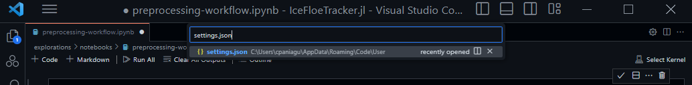
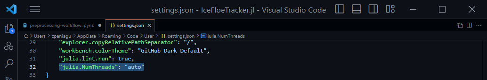

## Recommened Settings
1. Install Julia
2. Install VS Code
3. Add the following extensions for VS Code: Julia, Jupyter
4. (Optional) Ensure Julia is set up to work with threading enabled for shared memory multiprocessing.
   a. Press Cmd+Shift+P (mac) or Ctrl+Shift+P (windows) to display the command palette and search for `settings.json` and choose the option that appears
   
    
    
   b. In the `settings.json` file, find the ` "julia.NumThreads"` option (near the bottom). Change its value to `"auto"` and save the file
   
   

5. Open the `./notebooks/preprocessing-workflow/preprocessing-workflow.ipynb` file within VS Code